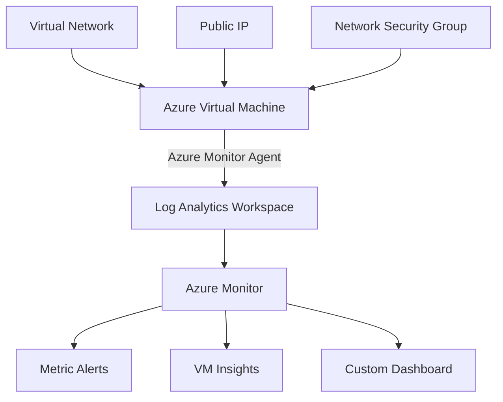

# 🔍 **Azure Monitor Complete Project**

> **Comprehensive Azure monitoring solution with multiple deployment options**

## ✨ **Features**
- ✅ Complete infrastructure deployment (VM, VNet, Log Analytics)
- ✅ Azure Monitor Agent with VM Insights
- ✅ CPU, Memory, Disk, and Network metrics alerts
- ✅ Custom Azure Dashboard with performance widgets
- ✅ Multiple deployment methods (CLI, Terraform, Bicep)
- ✅ One-click deployment script
- ✅ Cleanup and maintenance scripts

---

## 🏗️ **Architecture**



---

## 📊 **Monitoring Components**

| Component | Purpose | Metrics Collected |
|-----------|---------|------------------|
| **Log Analytics Workspace** | Centralized log storage and analysis | System logs, performance counters, events |
| **Azure Monitor Agent** | Data collection from VM | CPU, Memory, Disk, Network, Process data |
| **VM Insights** | Comprehensive VM monitoring | Performance maps, dependency tracking |
| **Metric Alerts** | Proactive monitoring notifications | CPU >80%, Memory >85%, Disk space <10% |
| **Custom Dashboard** | Visual performance overview | Real-time charts and KPI widgets |

---

## 📁 **Project Structure**

```
azure-monitor-project/
├── 📜 README.md                    # This documentation
├── 📋 DEPLOYMENT.md                # Quick deployment guide
├── 📊 dashboard.json               # Azure Dashboard template
├── 📂 scripts/                     # Deployment and management scripts
│   ├── 🚀 deploy-all.sh           # One-click complete deployment
│   ├── 📊 create-law.sh           # Log Analytics Workspace setup
│   ├── 🔍 enable-vminsights.sh    # VM Insights configuration
│   ├── ⚠️ create-alert.sh         # Metric alerts setup
│   └── 🧹 cleanup.sh              # Resource cleanup
├── 📂 terraform/                   # Infrastructure as Code (Terraform)
│   ├── main.tf                    # Main Terraform configuration
│   ├── variables.tf               # Input variables
│   └── outputs.tf                 # Output values
└── 📂 bicep/                      # Infrastructure as Code (Bicep)
    ├── main.bicep                 # Main deployment template
    ├── loganalytics.bicep         # Log Analytics resources
    ├── vminsights.bicep           # VM monitoring setup
    └── alerts.bicep               # Alert rules configuration
```

---

# 🪜 **3. Step-by-Step Deployment**

---

## **Step 1 — Create Resource Group**

### **Azure CLI**

```bash
az group create \
  --name monitor-rg \
  --location eastus
```

---

## **Step 2 — Create Log Analytics Workspace**

### **Azure CLI**

```bash
az monitor log-analytics workspace create \
  --resource-group monitor-rg \
  --workspace-name atul-law \
  --location eastus
```

### **Bash Script (`scripts/create-law.sh`)**

```bash
#!/bin/bash
RG="monitor-rg"
LAW="atul-law"
LOCATION="eastus"

az monitor log-analytics workspace create \
  --resource-group $RG \
  --workspace-name $LAW \
  --location $LOCATION
```

---

## **Step 3 — Deploy a Test Virtual Machine**

```bash
az vm create \
  --resource-group monitor-rg \
  --name monitor-vm \
  --image UbuntuLTS \
  --admin-username azureuser \
  --generate-ssh-keys
```

---

## **Step 4 — Install Azure Monitor Agent (AMA) & Enable VM Insights**

### **Enable VM Insights with CLI**

```bash
WORKSPACE_ID=$(az monitor log-analytics workspace show \
  --resource-group monitor-rg \
  --workspace-name atul-law \
  --query customerId -o tsv)

az vm extension set \
  --name AzureMonitorLinuxAgent \
  --publisher Microsoft.Azure.Monitor \
  --resource-group monitor-rg \
  --vm-name monitor-vm \
  --workspace-id $WORKSPACE_ID
```

---

### **Script (`scripts/enable-vminsights.sh`)**

```bash
#!/bin/bash
RG="monitor-rg"
VM="monitor-vm"
LAW="atul-law"

WID=$(az monitor log-analytics workspace show \
  --resource-group $RG \
  --workspace-name $LAW \
  --query customerId -o tsv)

az vm extension set \
  --publisher Microsoft.Azure.Monitor \
  --name AzureMonitorLinuxAgent \
  --resource-group $RG \
  --vm-name $VM \
  --workspace-id $WID
```

---

## **Step 5 — Create CPU Alert Rule**

### CLI: Create Alert When CPU > 80%

```bash
az monitor metrics alert create \
  --name cpu-high-alert \
  --resource-group monitor-rg \
  --scopes $(az vm show -g monitor-rg -n monitor-vm --query id -o tsv) \
  --condition "avg Percentage CPU > 80" \
  --description "CPU alert for VM" \
  --window-size 5m \
  --evaluation-frequency 1m
```

---

### **Script (`scripts/create-alert.sh`)**

```bash
#!/bin/bash
VM_ID=$(az vm show -g monitor-rg -n monitor-vm --query id -o tsv)

az monitor metrics alert create \
  --name cpu-high-alert \
  --resource-group monitor-rg \
  --scopes $VM_ID \
  --condition "avg Percentage CPU > 80" \
  --description "CPU exceeds 80%" \
  --window-size 5m \
  --evaluation-frequency 1m
```

---

# 📊 **Step 6 — Create Azure Dashboard (Basic Template)**

### CLI Dashboard Deployment

```bash
az portal dashboard create \
  --resource-group monitor-rg \
  --name atul-monitor-dashboard \
  --input-path dashboard.json
```

### Example `dashboard.json`

```json
{
  "lenses": {
    "0": {
      "parts": {
        "0": {
          "position": { "x": 0, "y": 0, "rowSpan": 4, "colSpan": 4 },
          "metadata": {
            "type": "Extension/HubsExtension/PartType/MarkdownPart",
            "settings": {
              "content": "## Azure Monitor Dashboard\nCPU, Memory, Disk Metrics"
            }
          }
        }
      }
    }
  }
}
```

---

# 🌱 **Terraform Implementation**

### `main.tf`

```hcl
provider "azurerm" {
  features {}
}

resource "azurerm_resource_group" "rg" {
  name     = "monitor-rg"
  location = "eastus"
}

resource "azurerm_log_analytics_workspace" "law" {
  name                = "atul-law"
  location            = azurerm_resource_group.rg.location
  resource_group_name = azurerm_resource_group.rg.name
  sku                 = "PerGB2018"
}

resource "azurerm_linux_virtual_machine" "vm" {
  name                = "monitor-vm"
  size                = "Standard_B1s"
  resource_group_name = azurerm_resource_group.rg.name
  location            = azurerm_resource_group.rg.location
  admin_username      = "azureuser"

  network_interface_ids = []
}

# Metric Alert
resource "azurerm_monitor_metric_alert" "cpu_alert" {
  name                = "cpu-alert"
  resource_group_name = azurerm_resource_group.rg.name
  scopes              = [azurerm_linux_virtual_machine.vm.id]

  criteria {
    metric_name        = "Percentage CPU"
    metric_namespace   = "Microsoft.Compute/virtualMachines"
    aggregation        = "Average"
    operator           = "GreaterThan"
    threshold          = 80
  }
}
```

---

# 🧱 **Bicep Implementation**

### `loganalytics.bicep`

```bicep
resource law 'Microsoft.OperationalInsights/workspaces@2022-10-01' = {
  name: 'atul-law'
  location: 'eastus'
  properties: {
    sku: {
      name: 'PerGB2018'
    }
  }
}
```

---

### `alerts.bicep`

```bicep
param vmId string

resource cpuAlert 'Microsoft.Insights/metricAlerts@2018-03-01' = {
  name: 'cpu-alert'
  location: 'global'
  properties: {
    description: 'CPU High Alert'
    scopes: [vmId]
    criteria: {
      allOf: [
        {
          metricName: 'Percentage CPU'
          timeAggregation: 'Average'
          operator: 'GreaterThan'
          threshold: 80
        }
      ]
    }
  }
}
```

---

# 📈 **7. Validation Steps (Portal)**

1. Go to **Azure Monitor → Logs**
   Run query:

   ```kusto
   Heartbeat
   | take 10
   ```

2. Go to **VM → Insights**
   ✔ Check CPU, Memory, Disk charts
   ✔ Dependency Map

3. Trigger CPU alert manually:

```bash
yes > /dev/null &
```

---
