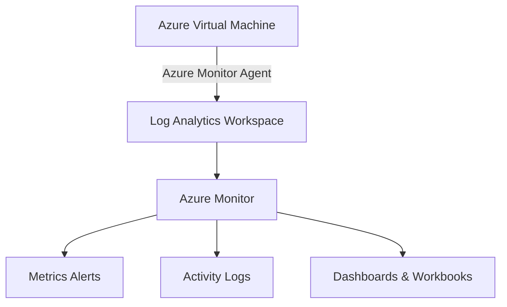

**Azure Monitor Basic Project** 

✔ Architecture diagram
✔ Step-by-step setup
✔ CLI + PowerShell + ARM/Bicep/Terraform scripts
✔ Log Analytics + VM Insights + Metrics + Alerts + Dashboards
✔ Perfect for GitHub README

---

# 📘 **Azure Monitor – Basic Project (Full Hands-On Guide)**

This project deploys a **Log Analytics Workspace**, **Azure Monitor Agent**, **VM Insights**, **Metrics Alerts**, and a **Custom Dashboard** for monitoring an Azure Virtual Machine.

---

## 🏗️ **Architecture Diagram**



---

# 🚀 **1. Project Overview**

| Component                     | Purpose                                    |
| ----------------------------- | ------------------------------------------ |
| **Log Analytics Workspace**   | Stores logs & metrics for analysis         |
| **Azure Monitor Agent (AMA)** | Sends logs from VM to LAW                  |
| **VM Insights**               | Performance & dependency monitoring        |
| **Alerts**                    | Trigger notifications on CPU, Memory, etc. |
| **Dashboard**                 | Visual monitoring in Azure Portal          |

---

# 📂 **2. Project Folder Structure**

```
azure-monitor-basic/
├── scripts/
│   ├── create-law.sh
│   ├── enable-vminsights.sh
│   ├── create-alert.sh
├── terraform/
│   ├── main.tf
│   ├── variables.tf
│   └── outputs.tf
├── bicep/
│   ├── loganalytics.bicep
│   ├── vminsights.bicep
│   └── alerts.bicep
└── README.md
```

---

# 🪜 **3. Step-by-Step Deployment**

---

## **Step 1 — Create Resource Group**

### **Azure CLI**

```bash
az group create \
  --name monitor-rg \
  --location eastus
```

---

## **Step 2 — Create Log Analytics Workspace**

### **Azure CLI**

```bash
az monitor log-analytics workspace create \
  --resource-group monitor-rg \
  --workspace-name atul-law \
  --location eastus
```

### **Bash Script (`scripts/create-law.sh`)**

```bash
#!/bin/bash
RG="monitor-rg"
LAW="atul-law"
LOCATION="eastus"

az monitor log-analytics workspace create \
  --resource-group $RG \
  --workspace-name $LAW \
  --location $LOCATION
```

---

## **Step 3 — Deploy a Test Virtual Machine**

```bash
az vm create \
  --resource-group monitor-rg \
  --name monitor-vm \
  --image UbuntuLTS \
  --admin-username azureuser \
  --generate-ssh-keys
```

---

## **Step 4 — Install Azure Monitor Agent (AMA) & Enable VM Insights**

### **Enable VM Insights with CLI**

```bash
WORKSPACE_ID=$(az monitor log-analytics workspace show \
  --resource-group monitor-rg \
  --workspace-name atul-law \
  --query customerId -o tsv)

az vm extension set \
  --name AzureMonitorLinuxAgent \
  --publisher Microsoft.Azure.Monitor \
  --resource-group monitor-rg \
  --vm-name monitor-vm \
  --workspace-id $WORKSPACE_ID
```

---

### **Script (`scripts/enable-vminsights.sh`)**

```bash
#!/bin/bash
RG="monitor-rg"
VM="monitor-vm"
LAW="atul-law"

WID=$(az monitor log-analytics workspace show \
  --resource-group $RG \
  --workspace-name $LAW \
  --query customerId -o tsv)

az vm extension set \
  --publisher Microsoft.Azure.Monitor \
  --name AzureMonitorLinuxAgent \
  --resource-group $RG \
  --vm-name $VM \
  --workspace-id $WID
```

---

## **Step 5 — Create CPU Alert Rule**

### CLI: Create Alert When CPU > 80%

```bash
az monitor metrics alert create \
  --name cpu-high-alert \
  --resource-group monitor-rg \
  --scopes $(az vm show -g monitor-rg -n monitor-vm --query id -o tsv) \
  --condition "avg Percentage CPU > 80" \
  --description "CPU alert for VM" \
  --window-size 5m \
  --evaluation-frequency 1m
```

---

### **Script (`scripts/create-alert.sh`)**

```bash
#!/bin/bash
VM_ID=$(az vm show -g monitor-rg -n monitor-vm --query id -o tsv)

az monitor metrics alert create \
  --name cpu-high-alert \
  --resource-group monitor-rg \
  --scopes $VM_ID \
  --condition "avg Percentage CPU > 80" \
  --description "CPU exceeds 80%" \
  --window-size 5m \
  --evaluation-frequency 1m
```

---

# 📊 **Step 6 — Create Azure Dashboard (Basic Template)**

### CLI Dashboard Deployment

```bash
az portal dashboard create \
  --resource-group monitor-rg \
  --name atul-monitor-dashboard \
  --input-path dashboard.json
```

### Example `dashboard.json`

```json
{
  "lenses": {
    "0": {
      "parts": {
        "0": {
          "position": { "x": 0, "y": 0, "rowSpan": 4, "colSpan": 4 },
          "metadata": {
            "type": "Extension/HubsExtension/PartType/MarkdownPart",
            "settings": {
              "content": "## Azure Monitor Dashboard\nCPU, Memory, Disk Metrics"
            }
          }
        }
      }
    }
  }
}
```

---

# 🌱 **Terraform Implementation**

### `main.tf`

```hcl
provider "azurerm" {
  features {}
}

resource "azurerm_resource_group" "rg" {
  name     = "monitor-rg"
  location = "eastus"
}

resource "azurerm_log_analytics_workspace" "law" {
  name                = "atul-law"
  location            = azurerm_resource_group.rg.location
  resource_group_name = azurerm_resource_group.rg.name
  sku                 = "PerGB2018"
}

resource "azurerm_linux_virtual_machine" "vm" {
  name                = "monitor-vm"
  size                = "Standard_B1s"
  resource_group_name = azurerm_resource_group.rg.name
  location            = azurerm_resource_group.rg.location
  admin_username      = "azureuser"

  network_interface_ids = []
}

# Metric Alert
resource "azurerm_monitor_metric_alert" "cpu_alert" {
  name                = "cpu-alert"
  resource_group_name = azurerm_resource_group.rg.name
  scopes              = [azurerm_linux_virtual_machine.vm.id]

  criteria {
    metric_name        = "Percentage CPU"
    metric_namespace   = "Microsoft.Compute/virtualMachines"
    aggregation        = "Average"
    operator           = "GreaterThan"
    threshold          = 80
  }
}
```

---

# 🧱 **Bicep Implementation**

### `loganalytics.bicep`

```bicep
resource law 'Microsoft.OperationalInsights/workspaces@2022-10-01' = {
  name: 'atul-law'
  location: 'eastus'
  properties: {
    sku: {
      name: 'PerGB2018'
    }
  }
}
```

---

### `alerts.bicep`

```bicep
param vmId string

resource cpuAlert 'Microsoft.Insights/metricAlerts@2018-03-01' = {
  name: 'cpu-alert'
  location: 'global'
  properties: {
    description: 'CPU High Alert'
    scopes: [vmId]
    criteria: {
      allOf: [
        {
          metricName: 'Percentage CPU'
          timeAggregation: 'Average'
          operator: 'GreaterThan'
          threshold: 80
        }
      ]
    }
  }
}
```

---

# 📈 **7. Validation Steps (Portal)**

1. Go to **Azure Monitor → Logs**
   Run query:

   ```kusto
   Heartbeat
   | take 10
   ```

2. Go to **VM → Insights**
   ✔ Check CPU, Memory, Disk charts
   ✔ Dependency Map

3. Trigger CPU alert manually:

```bash
yes > /dev/null &
```

---
