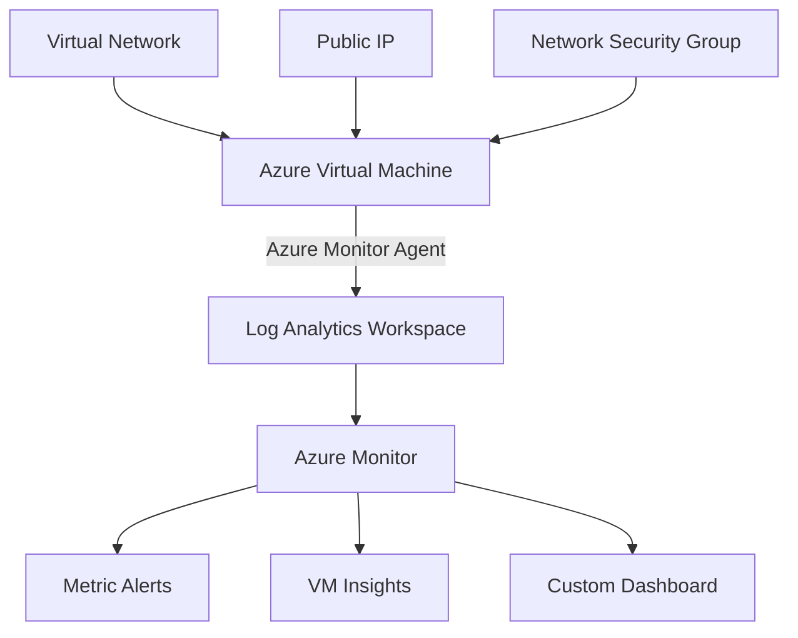

# 🔍 **Azure Monitor Complete Project**

> **Comprehensive Azure monitoring solution with multiple deployment options**

## ✨ **Features**
- ✅ Complete infrastructure deployment (VM, VNet, Log Analytics)
- ✅ Azure Monitor Agent with VM Insights
- ✅ CPU, Memory, Disk, and Network metrics alerts
- ✅ Custom Azure Dashboard with performance widgets
- ✅ Multiple deployment methods (CLI, Terraform, Bicep)
- ✅ One-click deployment script
- ✅ Cleanup and maintenance scripts

---

## 🏗️ **Architecture**



---

## 📊 **Monitoring Components**

| Component | Purpose | Metrics Collected |
|-----------|---------|------------------|
| **Log Analytics Workspace** | Centralized log storage and analysis | System logs, performance counters, events |
| **Azure Monitor Agent** | Data collection from VM | CPU, Memory, Disk, Network, Process data |
| **VM Insights** | Comprehensive VM monitoring | Performance maps, dependency tracking |
| **Metric Alerts** | Proactive monitoring notifications | CPU >80%, Memory >85%, Disk space <10% |
| **Custom Dashboard** | Visual performance overview | Real-time charts and KPI widgets |

---

## 📁 **Project Structure**

```
azure-monitor-project/
├── 📜 README.md                    # This documentation
├── 📋 DEPLOYMENT.md                # Quick deployment guide
├── 📊 dashboard.json               # Azure Dashboard template
├── 📂 scripts/                     # Deployment and management scripts
│   ├── 🚀 deploy-all.sh           # One-click complete deployment
│   ├── 📊 create-law.sh           # Log Analytics Workspace setup
│   ├── 🔍 enable-vminsights.sh    # VM Insights configuration
│   ├── ⚠️ create-alert.sh         # Metric alerts setup
│   └── 🧹 cleanup.sh              # Resource cleanup
├── 📂 terraform/                   # Infrastructure as Code (Terraform)
│   ├── main.tf                    # Main Terraform configuration
│   ├── variables.tf               # Input variables
│   └── outputs.tf                 # Output values
└── 📂 bicep/                      # Infrastructure as Code (Bicep)
    ├── main.bicep                 # Main deployment template
    ├── loganalytics.bicep         # Log Analytics resources
    ├── vminsights.bicep           # VM monitoring setup
    └── alerts.bicep               # Alert rules configuration
```

---

## 🚀 **Quick Start**

### ⚡ **Option 1: One-Click Deployment**
```bash
# Clone and deploy everything in one command
git clone https://github.com/atulkamble/azure-monitor-project.git
cd azure-monitor-project
chmod +x scripts/deploy-all.sh

# Deploy with default email
./scripts/deploy-all.sh

# OR deploy with your custom email for alerts
./scripts/deploy-all.sh your-email@domain.com
```

### 🏗️ **Option 2: Terraform Deployment**
```bash
cd terraform
terraform init
terraform plan
terraform apply
```

### 📐 **Option 3: Bicep Deployment**
```bash
az deployment sub create \
  --location eastus \
  --template-file bicep/main.bicep \
  --parameters sshPublicKey="$(cat ~/.ssh/id_rsa.pub)"
```

### 📋 **Option 4: Step-by-Step Manual**
See [DEPLOYMENT.md](DEPLOYMENT.md) for detailed manual deployment steps.

---

## 🛠️ **Prerequisites**

Before deploying, ensure you have:

- ✅ **Azure CLI** installed and authenticated (`az login`)
- ✅ **SSH key pair** generated (`ssh-keygen -t rsa -b 2048`)
- ✅ **Terraform** (optional, for Terraform deployment)
- ✅ **Azure subscription** with appropriate permissions
- ✅ **VM quota** for Standard_B series VMs (requires 2 vCPUs)
- ✅ **Contributor or Owner** role on the subscription/resource group

### 🔍 **Quota Check**
Verify your VM quota before deployment:
```bash
az vm list-usage --location eastus --query "[?contains(name.value, 'standardBSFamily')]" -o table
```

---

## 🎯 **Deployed Resources**

After successful deployment, you'll have:

| Resource Type | Resource Name | Specifications | Purpose |
|---------------|---------------|----------------|----------|
| **Resource Group** | `monitor` | East US | Container for all resources |
| **Log Analytics Workspace** | `mylaw` | PerGB2018, 30-day retention | Centralized logging and analytics |
| **Virtual Machine** | `monitor-vm` | Ubuntu 22.04 LTS, Standard_B2s | Monitoring target (2 vCPUs, 4GB RAM) |
| **Virtual Network** | `monitor-vmVNET` | 10.0.0.0/16 | Isolated network environment |
| **Public IP** | `monitor-vmPublicIP` | Dynamic assignment | External SSH access |
| **Network Security Group** | `monitor-vmNSG` | SSH (22) allowed | Network security rules |
| **OMS Agent** | `OmsAgentForLinux` | v1.19+ | Log collection and monitoring |
| **Action Group** | `monitor-action-group` | Email notifications | Alert routing |
| **CPU Alert** | `cpu-high-alert` | >80% for 5 min | Performance monitoring |

---

## 📊 **Monitoring Features**

### 🔍 **VM Insights** 
- Real-time performance monitoring via OMS Agent
- System logs and performance counters
- Historical performance trends
- Custom metric collection
- Process and service monitoring

### ⚠️ **Configured Alerts**
- **CPU Alert**: Triggers when CPU > 80% (5-minute window)
- **Memory Alert**: Available memory < 15% (when supported)
- **Email Notifications**: Sent to configured email address
- **Alert Severity**: Level 2 (Warning)
- **Evaluation Frequency**: Every 1 minute

### 📈 **Available Metrics**
- CPU utilization percentage
- Memory usage and availability
- Disk I/O operations and space
- Network bytes in/out
- Process count and resource usage
- System events and logs

---

## 🔧 **Troubleshooting**

### **Common Issues and Solutions**

#### **VM Quota Exceeded**
```
QuotaExceeded: Operation could not be completed as it results in exceeding approved standardDSv5Family Cores quota
```
**Solution**: The script uses `Standard_B2s` which requires BS Family quota. Check available quota:
```bash
az vm list-usage --location eastus --query "[?limit != '0']" -o table
```

#### **Unsupported OS Version**
```
Error: Unsupported operating system: ubuntu 24.04
```
**Solution**: Script uses Ubuntu 22.04 LTS for OMS Agent compatibility.

#### **Extension Installation Failed**
```
VMExtensionProvisioningError: Not all required GCS parameters are provided
```
**Solution**: Script installs OmsAgentForLinux instead of AzureMonitorLinuxAgent for better compatibility.

#### **Dashboard Creation Failed**
```
Failed to parse 'lenses' from property
```
**Solution**: Dashboard creation is optional. Create manually in Azure Portal if needed.

---

## 🧪 **Testing & Validation**

### Generate Test Load
```bash
# Get VM public IP
VM_IP=$(az vm show --resource-group monitor --name monitor-vm --show-details --query publicIps -o tsv)
echo "VM Public IP: $VM_IP"

# SSH into the VM
ssh azureuser@$VM_IP

# Install stress testing tools
sudo apt update && sudo apt install stress-ng htop -y

# Generate CPU load to trigger alerts (>80% for 5+ minutes)
stress-ng --cpu 2 --timeout 300s

# Monitor system resources
htop  # Press 'q' to quit

# Check memory usage
free -h

# Monitor disk usage
df -h
```

### Verify Monitoring
1. **Azure Portal** → **Monitor** → **Metrics**
2. **Virtual Machines** → **monitor-vm** → **Insights**
3. **Monitor** → **Alerts** → Check alert rules
4. **Dashboards** → View custom dashboard

---

## 🛠️ **Infrastructure as Code**

### 🌱 **Terraform Configuration**

The Terraform implementation provides complete infrastructure deployment:

**Key Resources:**
- Resource Group with configurable name and location
- Log Analytics Workspace with PerGB2018 pricing tier  
- Virtual Network with subnets and security groups
- Ubuntu VM with SSH key authentication
- Azure Monitor Agent extension
- Multiple metric alerts (CPU, Memory, Disk)
- Network security rules for SSH access

**Deployment:**
```bash
cd terraform
terraform init
terraform plan -var="admin_username=your-username"
terraform apply
```

### 📐 **Bicep Templates**

Modular Bicep templates for Azure-native deployment:

**Template Structure:**
- **`main.bicep`**: Orchestrates all deployments at subscription scope
- **`loganalytics.bicep`**: Log Analytics Workspace and data collection rules
- **`vminsights.bicep`**: VM Insights configuration and monitoring extensions  
- **`alerts.bicep`**: Comprehensive metric alerting rules

**Features:**
- Parameterized for flexible deployment
- Subscription-scoped deployment
- Automatic networking and security configuration
- VM Insights with dependency tracking

---

## 📊 **Log Analytics Queries**

### 🔍 **Performance Monitoring**
```kusto
// CPU utilization over time
Perf
| where ObjectName == "Processor" and CounterName == "% Processor Time"
| summarize avg(CounterValue) by bin(TimeGenerated, 5m)
| render timechart

// Memory usage analysis  
Perf
| where ObjectName == "Memory" and CounterName == "Available MBytes"
| summarize avg(CounterValue) by bin(TimeGenerated, 5m)
| render timechart

// Disk space monitoring
Perf
| where ObjectName == "LogicalDisk" and CounterName == "% Free Space"
| summarize avg(CounterValue) by bin(TimeGenerated, 1h), InstanceName
| render timechart
```

### 🚨 **Alert Investigation**
```kusto
// Recent alerts fired
Alert
| where TimeGenerated > ago(24h)
| summarize count() by AlertName, AlertSeverity
| order by count_ desc

// VM heartbeat monitoring
Heartbeat
| where Computer contains "monitor-vm"
| summarize max(TimeGenerated) by Computer
| where max_TimeGenerated < ago(5m)
```

---

## 🧹 **Cleanup & Maintenance**

### 🗑️ **Resource Cleanup**
```bash
# Remove all resources
chmod +x scripts/cleanup.sh
./scripts/cleanup.sh

# Or manual cleanup
az group delete --name monitor --yes --no-wait
```

### 🔄 **Update Management**
```bash
# Update Azure Monitor Agent
az vm extension set \
  --publisher Microsoft.Azure.Monitor \
  --name AzureMonitorLinuxAgent \
  --resource-group monitor \
  --vm-name monitor-vm \
  --enable-auto-upgrade true
```

### 💰 **Cost Optimization**
- **VM Size**: Consider B-series burstable VMs for dev/test
- **Log Retention**: Configure appropriate retention policies
- **Alert Frequency**: Balance monitoring needs with costs
- **Data Collection**: Use targeted data collection rules

---

## 🐛 **Troubleshooting**

### Common Issues & Solutions

| Issue | Cause | Solution |
|-------|-------|----------|
| **VM Agent not reporting** | Extension not installed | Run `enable-vminsights.sh` script |
| **No metrics in dashboard** | Data collection delay | Wait 5-10 minutes for initial data |
| **Alerts not firing** | Threshold misconfiguration | Check alert rule criteria |
| **SSH connection failed** | NSG rules or key issues | Verify security group and SSH keys |

### 🔧 **Debug Commands**
```bash
# Check VM extension status
az vm extension list --resource-group monitor --vm-name monitor-vm

# Verify Log Analytics connection
az monitor log-analytics workspace show --resource-group monitor --workspace-name mylaw

# List active alerts
az monitor metrics alert list --resource-group monitor
```

---

## 📚 **Additional Resources**

### 📖 **Documentation**
- [Azure Monitor Documentation](https://docs.microsoft.com/en-us/azure/azure-monitor/)
- [VM Insights Overview](https://docs.microsoft.com/en-us/azure/azure-monitor/insights/vminsights-overview)
- [Log Analytics Workspace](https://docs.microsoft.com/en-us/azure/azure-monitor/logs/log-analytics-workspace-overview)
- [Azure Monitor Agent](https://docs.microsoft.com/en-us/azure/azure-monitor/agents/azure-monitor-agent-overview)

### 🎓 **Learning Paths**
- [Monitor and back up Azure resources](https://docs.microsoft.com/en-us/learn/paths/monitor-backup-azure-resources/)
- [Implement resource management security in Azure](https://docs.microsoft.com/en-us/learn/paths/implement-resource-mgmt-security/)

### 🔗 **Related Projects**
- [Azure Monitoring Best Practices](https://github.com/Azure/azure-monitor-baseline-alerts)
- [Azure Resource Manager Templates](https://github.com/Azure/azure-quickstart-templates)
- [Terraform Azure Provider](https://registry.terraform.io/providers/hashicorp/azurerm/latest)

---

## 🤝 **Contributing**

Contributions are welcome! Please feel free to submit a Pull Request. For major changes, please open an issue first to discuss what you would like to change.

### 📋 **Development Setup**
1. Fork the repository
2. Create a feature branch (`git checkout -b feature/amazing-feature`)
3. Commit your changes (`git commit -m 'Add amazing feature'`)
4. Push to the branch (`git push origin feature/amazing-feature`)
5. Open a Pull Request

### 🧪 **Testing**
- Test deployments in a separate Azure subscription
- Validate all deployment methods (CLI, Terraform, Bicep)
- Ensure cleanup scripts work properly
- Verify monitoring functionality

---

## 📄 **License**

This project is licensed under the MIT License - see the [LICENSE](LICENSE) file for details.

---

## ⭐ **Acknowledgments**

- Azure Monitor team for excellent documentation
- Community contributors for best practices
- Microsoft Learn for comprehensive tutorials

---

> **💡 Tip**: Star this repository if you find it helpful and share it with others who are learning Azure monitoring!
